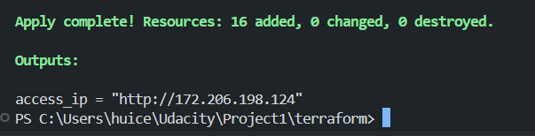
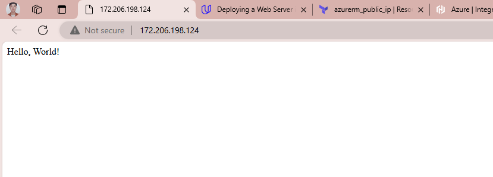

# Project 1 - Udacity

## Getting Started

To get started with this project, follow the steps below:

1. Clone the repository to your local machine.
2. Create a policy definition and assign it to your subscription
3. Install the plugin for Packer, Terraform
4. Deploy packer, terraform to Azure
5. Look at the output IP to access the website

## Instructions

This section provides detailed instructions on how to use the project. Include any specific steps or requirements here.
1. Create policy definition
```powershell
az policy definition create --name 'deny-resources-without-tags' --display-name 'Deny resources without tags' --description 'This policy denies the creation of resources that do not have any tags.' --rules policy.json --mode Indexed --subscription <your_subscription_id>
```
2. Create assignment to your subscription
```powershell
az policy assignment create --name 'tagging-policy' --policy 'deny-resources-without-tags' --scope '/subscriptions/<your_subscription_id>'
```

3. Install plugin for packer
```powershell
cd packer
packer plugins install github.com/hashicorp/azure
```
4. Install plugin for terraform
```powershell
cd terraform
terraform init
```
5. Add some environment variables to your shell 
```powershell
$env:ARM_CLIENT_ID=<your_client_id>
$env:ARM_CLIENT_SECRET=<your_client_secret>
$env:ARM_SUBSCRIPTION_ID=<your_sub_id>
$env:ARM_RESOURCE_GROUP=<your_rg_id>
```
6. Use packer to create an image on Azure (Hello, World!)
```powershell
cd packer
packer build server.json
```
7. Get the id of image created by packer and replace it in terraform.tfvars (field: image_id)
8. Deploy resources to Azure using Terraform. Type the password you want for SSH to VMs
```powershell
terraform plan
terraform apply
```
9. Get the IP in the output section and open it in your browser



## Customize

To customize the deployment, you need to modify the `terraform.tfvars` file. Follow the steps below:

1. Open the `terraform.tfvars` file in your text editor.
2. You will see several variables defined in this file. Here's what they mean:
   - `resource_group_name`: The name of the resource group in Azure where all resources will be deployed.
   - `subscription_id`: The ID of your Azure subscription.
   - `location`: The location/region where you want to deploy your resources.
   - `vm_count`: The number of virtual machines to create.
   - `image_id`: The ID of the image to use for the virtual machines.
3. Replace the default values with your own. For example:
   ```hcl
   resource_group_name = "MyResourceGroup"
   subscription_id = "12345678-1234-1234-1234-123456789012"
   location = "westus"
   vm_count = 3
   image_id = "/subscriptions/12345678-1234-1234-1234-123456789012/resourceGroups/MyResourceGroup/providers/Microsoft.Compute/images/myImage"
